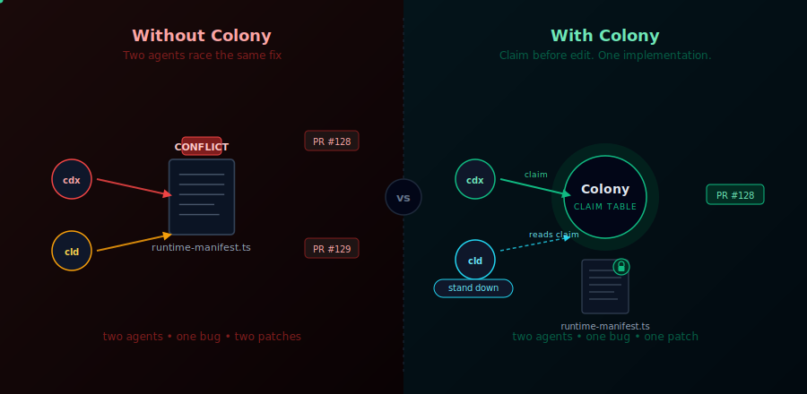
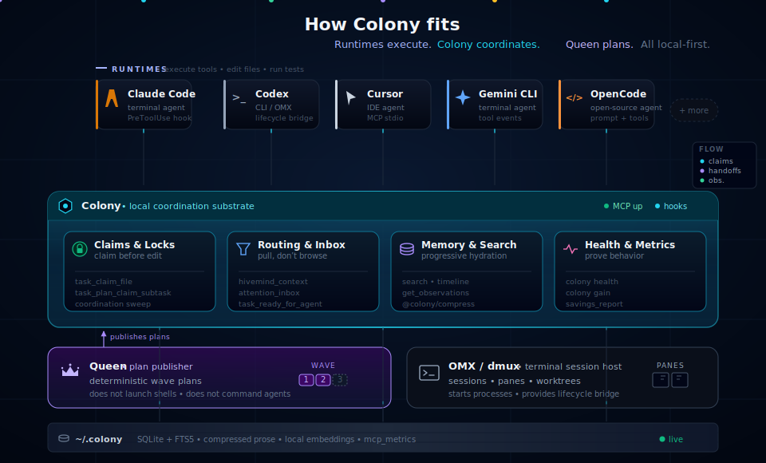

# Colony

<p align="center">
  
</p>

<p align="center">
  <strong>Local-first coordination for fleets of coding agents.</strong><br/>
  Claims, handoffs, plans, health, and memory for Claude Code, Codex, Cursor, Gemini CLI, OpenCode, and other agent runtimes.
</p>

<p align="center">
  <a href="LICENSE"></a>
  
  
  
</p>

```bash
npm install -g @imdeadpool/colony-cli
colony install --ide codex
colony health
```

Colony is **not a hosted control plane** and it does not run your agents. Codex,
Claude Code, Cursor, OMX, dmux, and other runtimes still execute work. Colony
is the shared local substrate they use to coordinate.

It is built for the expensive part of multi-agent work: avoiding repeated
context reloads. Claims, handoffs, timelines, and prior decisions stay compact
until an agent explicitly hydrates the full record. The result is measurable —
`colony gain` reports both the shared reference model below and live
`mcp_metrics` rows from your local MCP server.

> Runtimes run agents.
> **Colony** coordinates agents.
> Queen publishes claimable plans.
> Agents pull ready work.
> Stale signals evaporate.

---

## The Problem: Two Agents, One Bug, Two Patches

A human can ask Codex and Claude to solve the same runtime-manifest bug at the
same time. Without a shared loop, both agents diagnose the same Turbopack root
escape, edit the same schema file, and race two PRs for one fix.

<p align="center">
  
</p>

With Colony, both agents start from `hivemind_context`, `attention_inbox`, and
`task_ready_for_agent`. The first agent records the diagnosis, claims the
task and files, and posts the intended fix. The second agent sees the live
claim and prior diagnosis **before editing**, so it can stand down, review, or
take a different unclaimed lane.

Colony does not run the agents for you. It makes duplicate work visible early,
turns one solution into one implementation branch, and keeps the evidence in a
shared task thread.

| Without Colony                         | With Colony                                     |
| -------------------------------------- | ----------------------------------------------- |
| Agents collide on the same files.      | Agents claim files before edits.                |
| Humans schedule parallel work by hand. | Agents pull ready subtasks from Colony.         |
| Progress is trapped in chat windows.   | Working state is saved to task threads.         |
| Old claims and handoffs stay noisy.    | Signals decay, expire, and can be swept.        |
| Follow-up ideas disappear.             | Proposals can be reinforced and promoted.       |
| Task lists become browsing surfaces.   | `task_ready_for_agent` becomes the work picker. |

---

## The Colony Loop

Every agent session runs the same six-step coordination loop. **Compact first.
Hydrate only when needed. Claim before editing.**

<p align="center">
  
</p>

| #   | Step                      | What it does                                            |
| --- | ------------------------- | ------------------------------------------------------- |
| 1   | `hivemind_context`        | Who's active, what's hot, what's owned, recent memory.  |
| 2   | `attention_inbox`         | Handoffs, blockers, stale lanes that need attention.    |
| 3   | `task_ready_for_agent`    | Pull claimable work matched to this agent — not browse. |
| 4   | `task_plan_claim_subtask` | Take exactly one unblocked wave slice from a Queen plan.|
| 5   | `task_claim_file`         | Make ownership visible **before** mutating the file.    |
| 6   | `task_note_working`       | Leave a compact resumable trail for the next session.   |

Steps 1–3 cost almost nothing (compact IDs and snippets). Full bodies only ship
when an agent explicitly calls `get_observations([ids])`. That's where the
token savings come from.

---

## How It Fits

Colony sits between the runtimes that execute work and the local SQLite store
that persists state. Queen is a peer, not a controller — it publishes
claimable plans, but agents still pull and complete the work themselves.

<p align="center">
  
</p>

| Layer                                                | Responsibility                                                                 |
| ---------------------------------------------------- | ------------------------------------------------------------------------------ |
| Codex / Claude Code / Cursor / Gemini CLI / OpenCode | Execute tools, edit files, run tests, talk to the user.                        |
| OMX / dmux / terminal sessions                       | Start sessions, panes, worktrees, and runtime process surfaces.                |
| **Colony**                                           | Route work, track claims, record handoffs, store memory, report health.        |
| Queen                                                | Publish deterministic wave plans; does not launch shells or command agents.    |

This split keeps execution close to the existing agent runtime while making the
coordination state shared, inspectable, and local.

---

## Install

```bash
npm install -g @imdeadpool/colony-cli
```

Register one or more runtimes:

```bash
colony install --ide claude-code
colony install --ide codex
colony install --ide cursor
colony install --ide gemini-cli
colony install --ide opencode
```

Check the install:

```bash
colony status
```

**Requirements:** Node.js 20+, pnpm for repository development, local SQLite
state under `~/.colony`.

---

## Daily Workflow

```bash
colony health                            # readiness, adoption, stale signals
colony health --fix-plan                 # guided recovery plan
colony status                            # storage, IDEs, worker, memory
colony search "error or decision"        # search prior observations
colony coordination sweep --json         # report stale claims, expired handoffs
colony queen sweep                       # find stalled or unclaimed plans
colony viewer                            # local read-only graph at :6510
pnpm smoke:codex-omx-pretool             # verify lifecycle bridge
pnpm smoke:health-repair-loop            # prove bridge + cleanup compose
```

Installed Codex and Claude hooks inject the quota-safe operating contract:
start with `hivemind_context`, then `attention_inbox`, then
`task_ready_for_agent`; accept or decline handoffs, claim files before edits,
keep `task_note_working` current, run focused verification, and hand off before
quota or session stop.

---

## Health

`colony health` shows whether agents are only **reading** Colony or actually
**coordinating** through it. The first screen is action-first: bad readiness
areas are grouped into the next exact command or MCP call. Lower-priority
follow-ups stay hidden until `--verbose`.

```text
Readiness summary
  coordination_readiness    good
  execution_safety          ok
  queen_plan_readiness      good
  working_state_migration   good
  signal_evaporation        good
```

Healthy runs trend toward:

| Metric                                            | Target                |
| ------------------------------------------------- | --------------------- |
| `hivemind_context -> attention_inbox`             | 50%+                  |
| `attention_inbox -> task_ready_for_agent`         | 90%+                  |
| `task_ready_for_agent -> task_plan_claim_subtask` | 30%+ when plans exist |
| claim-before-edit                                 | 50%+                  |
| Colony note share                                 | 70%+                  |
| stale claims                                      | near zero active      |

| If this is red            | First move                                                  |
| ------------------------- | ----------------------------------------------------------- |
| `coordination_readiness`  | Check agent startup loop adoption.                          |
| `execution_safety`        | Run `pnpm smoke:codex-omx-pretool` and verify hook install. |
| `queen_plan_readiness`    | Publish or repair claimable Queen plans.                    |
| `working_state_migration` | Use `task_note_working` instead of ad hoc notepads.         |
| `signal_evaporation`      | Run a dry sweep, then explicit safe stale-claim cleanup.    |

`execution_safety` includes a source-level `root_cause` in `--json` when edit
telemetry cannot be trusted:

| Root cause                     | Meaning                                                                       | First command                                                                                     |
| ------------------------------ | ----------------------------------------------------------------------------- | ------------------------------------------------------------------------------------------------- |
| `lifecycle_bridge_unavailable` | runtime/lifecycle bridge is unavailable                                       | `colony install --ide <ide>` then `pnpm smoke:codex-omx-pretool`                                  |
| `lifecycle_bridge_silent`      | bridge is available, but PreToolUse edit-path telemetry is empty or near-zero | `colony install --ide <ide>` then `colony health --hours 1 --json`                                |
| `lifecycle_paths_missing`      | PreToolUse exists, but edit events lack `file_path`                           | `colony bridge lifecycle --json --ide <ide> --cwd <repo_root> < colony-omx-lifecycle-v1.pre.json` |
| `lifecycle_claim_mismatch`     | paths exist, but claim metadata does not match edit scope                     | `colony bridge lifecycle --json --ide <ide> --cwd <repo_root> < colony-omx-lifecycle-v1.pre.json` |
| `no_hook_capable_edits`        | the selected window has no file edit events to diagnose                       | `colony health --hours 1 --json`                                                                  |

When `task_claim_file before edits` says `metric unreliable`, fix runtime
bridge or metadata first. Do not treat a bad claim ratio as agent discipline
until `omx_runtime_bridge.status` is fresh and edit events carry paths.

Safe stale-claim cleanup is opt-in because releasing a claim changes who may
edit a file:

```bash
colony health --fix-plan
colony coordination sweep --json
colony coordination sweep --release-safe-stale-claims --json
colony health --hours 1
```

---

## Token Savings

Colony saves tokens by making coordination compact, searchable, and
progressively hydrated. `colony gain` shows live `mcp_metrics` receipts first,
then a shared reference model for common agent loops.

<p align="center">
  
</p>

```bash
colony gain                       # live + reference, last 7 days
colony gain --hours 24 --json     # last 24 hours as JSON
colony gain --operation search    # filter live rows to one tool name
colony gain --session-limit 0     # print every live session in the window
colony gain --input-cost-per-1m 1.25 --output-cost-per-1m 10
```

Why the savings show up where they do:

- **Compression at rest.** Every observation runs through `@colony/compress`
  before SQLite. Prose shrinks ~70% while paths, URLs, code, commands, version
  numbers, and dates stay byte-for-byte intact.
- **Progressive disclosure.** `search`, `timeline`, `attention_inbox`,
  `task_ready_for_agent`, and friends return compact IDs plus snippets. Full
  bodies only ship via `get_observations([ids])`, so callers pay only for what
  they hydrate.
- **Cross-session recall.** Instead of re-reading 5–10 files plus `git log`
  to rederive prior decisions, agents `search` and pull a single observation.
- **Claim-aware routing.** `task_ready_for_agent` returns the next claimable
  action and exact claim arguments, so agents stop browsing task lists just to
  choose work.
- **Stale-signal decay.** Expired handoffs, weak claims, and stranded lanes
  surface as compact attention items instead of full historical transcripts.
- **Tiny handoffs.** A durable handoff can be `branch`, `task`, `blocker`,
  `next`, and `evidence` instead of a pasted session log.

<details>
<summary><strong>Full reference table — all 21 operations</strong></summary>

| Operation                            | Frequency / session | Standard | Colony | Saved |
| ------------------------------------ | ------------------- | -------- | ------ | ----- |
| Recall prior decision                | 5x                  | 8,000    | 1,500  | 81%   |
| Resume task across sessions          | 3x                  | 15,000   | 2,000  | 87%   |
| Startup coordination sweep           | 1x                  | 25,000   | 2,500  | 90%   |
| Coordinate parallel agents           | 10x                 | 20,000   | 3,000  | 85%   |
| Why-was-this-changed                 | 4x                  | 8,000    | 1,200  | 85%   |
| Find active owner for a file         | 6x                  | 6,000    | 500    | 92%   |
| Recover stranded lane                | 1x                  | 18,000   | 1,800  | 90%   |
| Cross-agent handoff                  | 2x                  | 30,000   | 400    | 99%   |
| Review task timeline                 | 4x                  | 12,000   | 900    | 93%   |
| Search result shape                  | 8x                  | 5,000    | 150    | 97%   |
| Ready-work selection                 | 3x                  | 9,000    | 700    | 92%   |
| Unread message triage                | 4x                  | 10,000   | 600    | 94%   |
| Claim-before-edit check              | 8x                  | 4,000    | 450    | 89%   |
| Plan subtask claim                   | 2x                  | 12,000   | 1,100  | 91%   |
| Spec context recall                  | 2x                  | 14,000   | 1,600  | 89%   |
| Health/adoption diagnosis            | 1x                  | 16,000   | 1,800  | 89%   |
| Examples pattern lookup              | 2x                  | 11,000   | 1,000  | 91%   |
| Blocker recurrence                   | 2x                  | 10,000   | 900    | 91%   |
| Drift / failed-verification recovery | 2x                  | 13,000   | 1,400  | 89%   |
| Quota-exhausted handoff              | 1x                  | 22,000   | 500    | 98%   |
| Storage at rest (per observation)    | 1x                  | 1,000    | 300    | 70%   |

</details>

The MCP `savings_report` tool returns the same data:

```json
{ "name": "savings_report", "input": { "hours": 24 } }
```

Live numbers are visible at `http://127.0.0.1:6510/savings` when
`colony viewer` is running. Add `?input_usd_per_1m=<usd>&output_usd_per_1m=<usd>`,
`?session_limit=0`, or set `COLONY_MCP_INPUT_USD_PER_1M` /
`COLONY_MCP_OUTPUT_USD_PER_1M` to show estimated USD cost per operation.

---

## Signal Lifecycle

Colony follows a stigmergic model: agents leave local traces, other agents
react to useful traces, and stale traces evaporate.

<p align="center">
  
</p>

| Biology            | Colony                                |
| ------------------ | ------------------------------------- |
| ant                | agent session                         |
| nest               | repository                            |
| pheromone          | claim, proposal, handoff, message     |
| evaporation        | TTL, decay, sweep                     |
| response threshold | agent profile plus ready-work ranking |
| queen              | plan publisher, not commander         |

Practical effects:

- fresh claims warn other agents before they edit
- old claims weaken so they stop blocking current work
- proposals can be reinforced instead of lost
- Queen waves unlock in order without assigning shells
- agents hydrate only relevant observation bodies after compact routing

---

## What Colony Can Do Right Now

| Capability                 | Current surface                                                                 |
| -------------------------- | ------------------------------------------------------------------------------- |
| Install runtime hooks      | `colony install --ide claude-code`, `codex`, `cursor`, `gemini-cli`, `opencode` |
| Capture local observations | lifecycle hooks, prompt events, tool events, session heartbeat                  |
| Search prior work          | `colony search`, MCP `search`, `timeline`, `get_observations`                   |
| See active lanes           | MCP `hivemind_context`, `attention_inbox`, CLI coordination reports             |
| Claim work safely          | `task_ready_for_agent`, `task_plan_claim_subtask`, `task_claim_file`            |
| Coordinate agents          | `task_post`, `task_message`, handoffs, working notes                            |
| Publish wave plans         | Queen plans and `task_plan_*` MCP tools                                         |
| Clean stale signals        | `colony coordination sweep`, `colony queen sweep`, health fix plans             |
| Inspect the graph          | `colony viewer` local read-only graph                                           |
| Measure token savings      | `colony gain`, MCP `savings_report`, viewer `/savings`                          |
| Prove behavior             | `colony health`, smoke tests, adoption metrics                                  |

Use Colony when you run more than one coding agent in the same repo, use
worktrees or parallel branches, need local-first memory, or want stale claims
and handoffs to stop shaping current work.

---

## MCP Quick Reference

Installs register the MCP server as `colony`, so tools appear as
`mcp__colony__...`. Colony MCP uses progressive disclosure: compact IDs,
snippets, routing hints, and status rows first; full observation bodies only
when requested.

| Tool                      | Use                                                                  |
| ------------------------- | -------------------------------------------------------------------- |
| `hivemind_context`        | Start/resume with active lanes, ownership, hot files, memory hits.   |
| `attention_inbox`         | See handoffs, messages, blockers, stale cleanup, stalled lanes.      |
| `task_ready_for_agent`    | Pull claimable work matched to the agent.                            |
| `task_plan_claim_subtask` | Claim a Queen subtask and its file scope.                            |
| `task_claim_file`         | Make ownership visible before editing.                               |
| `task_note_working`       | Save compact resumable state.                                        |
| `task_message`            | Send directed or broadcast agent coordination messages.              |
| `task_foraging_report`    | Review weak proposals and promoted future work.                      |
| `savings_report`          | Live mcp_metrics rows + reference model; same data as `colony gain`. |

Copy-paste startup:

```json
{
  "name": "hivemind_context",
  "input": {
    "repo_root": "/abs/repo",
    "query": "current task or branch",
    "memory_limit": 3,
    "limit": 20
  }
}
```

```json
{
  "name": "attention_inbox",
  "input": {
    "session_id": "sess_abc",
    "agent": "codex",
    "repo_root": "/abs/repo"
  }
}
```

```json
{
  "name": "task_ready_for_agent",
  "input": {
    "session_id": "sess_abc",
    "agent": "codex",
    "repo_root": "/abs/repo",
    "limit": 5
  }
}
```

When plan work is claimable, `task_ready_for_agent` returns
`next_tool: "task_plan_claim_subtask"` plus exact `claim_args`. When no work
is claimable, it returns an empty state that tells the agent to publish a
Queen/task plan for multi-agent work.

Full MCP catalog: [docs/mcp.md](docs/mcp.md)

---

## Storage

Default local state:

```text
~/.colony/settings.json
~/.colony/data.db
~/.colony/models/
~/.colony/logs/
```

SQLite stores the coordination substrate. Embeddings are lazy and local by
default with `Xenova/all-MiniLM-L6-v2`; Ollama and OpenAI-style providers are
opt-in through settings. Persisted prose is compressed at rest through
`@colony/compress`; technical tokens such as paths, URLs, code, commands,
versions, dates, and numeric literals are preserved byte-for-byte.

---

## Repository Layout

```text
apps/cli             user-facing colony binary
apps/mcp-server      stdio MCP server and tool registrations
apps/worker          local HTTP worker, viewer host, embedding backfill
packages/core        MemoryStore facade and domain models
packages/storage     SQLite, FTS5, migrations, storage API
packages/hooks       lifecycle hook handlers and active-session heartbeat
packages/installers  per-runtime integration modules
packages/queen       deterministic plan decomposition and sweeps
packages/spec        spec grammar, changes, scoped context
docs                 architecture and workflow docs
```

Deeper docs:

- [Architecture](docs/architecture.md)
- [MCP tools](docs/mcp.md)
- [Queen plans](docs/QUEEN.md)
- [Compression](docs/compression.md)
- [Development](docs/development.md)
- [Proposal task threads](docs/proposal-task-threads.md)

---

## Development

```bash
pnpm install
pnpm typecheck
pnpm lint
pnpm test
pnpm build
```

Before merging changes:

```bash
pnpm typecheck && pnpm lint && pnpm test && pnpm build
```

Publish-path changes should also run:

```bash
bash scripts/e2e-publish.sh
```

Do not run `npm publish` from the repository root. Publish through the root
wrapper:

```bash
pnpm publish:cli:dry-run
pnpm publish:cli
```

---

## Architecture Rules

- Keep behavior local-first.
- Persist prose through `MemoryStore` so compression, privacy stripping, and storage invariants apply.
- Keep all database I/O inside `@colony/storage`.
- Keep settings access inside `@colony/config`.
- Keep MCP compact shapes compact; hydrate with `get_observations`.
- Keep hooks fast and free of network calls.
- Add tests for hooks, storage behavior, MCP contracts, installer changes, and compression rules.
- Keep CLI names, MCP namespace, package names, paths, and examples aligned on `colony`.

---

## Rough Edges

- Claim-before-edit is strongest when the runtime provides a real pre-edit hook. Codex/OMX integrations may need a bridge when native PreToolUse is unavailable.
- Queen planning is active work: Queen publishes structure, but agents still need to claim and complete subtasks.
- Pheromone half-life, proposal thresholds, and routing weights need tuning from real multi-agent use.
- MCP transport is stdio-based, so an IDE/runtime restart can close the server process; the next installed tool call should reconnect.
- The viewer is useful for inspection, but the primary workflow is terminal and agent driven.

---

## Contributing

Use Colony on real work, then report the places where coordination felt wrong:
stale claims, confusing handoffs, missing session context, noisy proposals,
stranded sessions, hot files that were missed, or edits that should have been
claimed before mutation.

For code changes, prefer small observable primitives over central
orchestration. Colony should help agents coordinate by leaving durable local
traces, not by becoming a remote control plane.

---

## License

MIT © Imdeadpool
