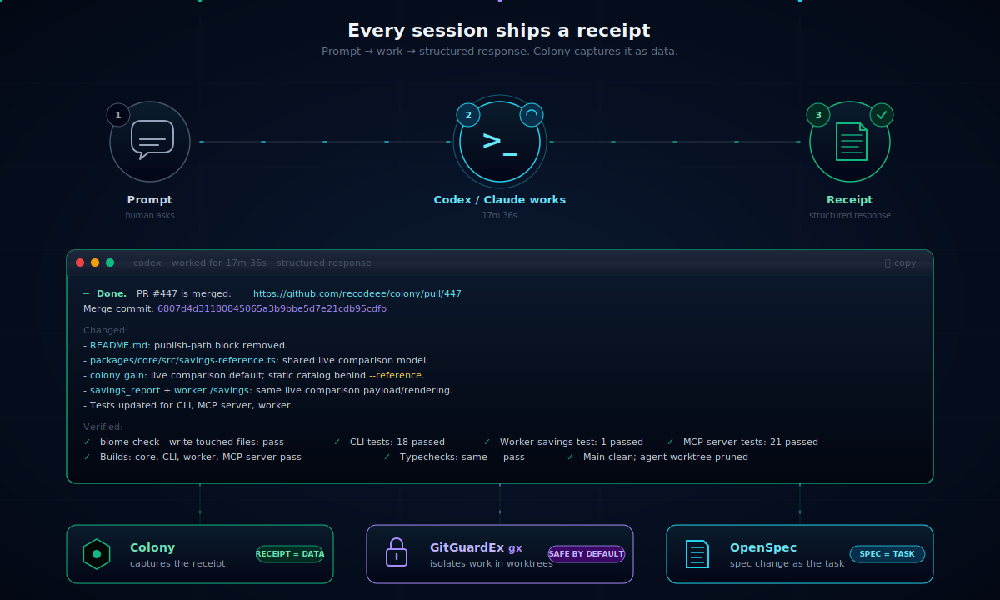
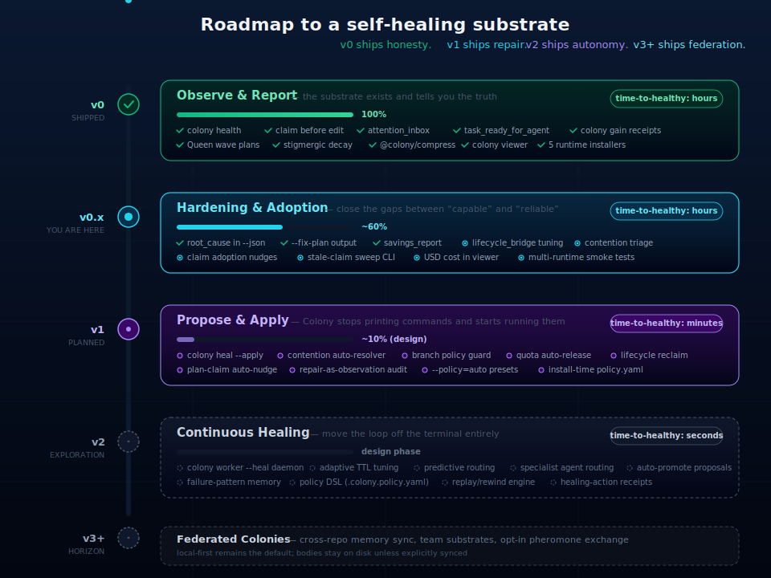

<p align="center">
  
</p>

<p align="center">
  <strong>Local-first coordination for fleets of coding agents.</strong><br/>
  Claims, handoffs, plans, health, and memory for Claude Code, Codex, Cursor, Gemini CLI, OpenCode, and other agent runtimes.
</p>

<p align="center">
  <a href="https://github.com/recodeee/colony/actions/workflows/ci.yml"></a>
  <a href="https://www.npmjs.com/package/@imdeadpool/colony-cli"></a>
  <a href="https://www.npmjs.com/package/@imdeadpool/colony-cli"></a>
  <a href="https://scorecard.dev/viewer/?uri=github.com/recodeee/colony"></a>
</p>

<p align="center">
  <a href="LICENSE"></a>
  
  <a href="https://github.com/recodeee/colony/stargazers"></a>
  <a href="https://github.com/recodeee/colony/commits/main"></a>
  
  
</p>

<p align="center">
  
</p>

```bash
npm install -g @imdeadpool/colony-cli
colony install --ide codex
colony health
```

## Release Notes

### `v0.x` - Current Patch Line

Colony is in the v0 hardening line. Upcoming patches focus on making the
shipped coordination loop easier to trust in real multi-agent runs.

- Patch adoption visibility: keep `colony health`, the local viewer, and
  `mcp_metrics` receipts aligned so gaps are visible without digging through
  SQLite.
- Patch workflow hygiene: make claims, task posts, handoffs, quota cleanup, and
  stale-session pruning clearer in status surfaces before they create duplicate
  work.
- Patch release confidence: keep README badges, publish smoke checks, and
  `@imdeadpool/colony-cli` package metadata current so users can see CI, npm
  version, downloads, license, and supply-chain posture before installing.

Colony is **not a hosted control plane** and it does not run your agents. Codex,
Claude Code, Cursor, OMX, dmux, and other runtimes still execute work. Colony
is the shared local substrate they use to coordinate.

It is built for the expensive part of multi-agent work: avoiding repeated
context reloads. Claims, handoffs, timelines, and prior decisions stay compact
until an agent explicitly hydrates the full record. The result is measurable —
`colony gain` reports both the shared reference model below and live
`mcp_metrics` rows from your local MCP server.

> Runtimes run agents.
> **Colony** coordinates agents.
> Queen publishes claimable plans.
> Agents pull ready work.
> Stale signals evaporate.

<p align="center">
  <a href="#token-savings"></a>
  <a href="#token-savings"></a>
  <a href="#token-savings"></a>
  <a href="#token-savings"></a>
</p>

<p align="center">
  <em>Measured per-operation savings versus standard agent loops.</em>
  <a href="#token-savings"><strong>See the receipts &#8594;</strong></a>
</p>

---

## The Problem: Two Agents, One Bug, Two Patches

A human can ask Codex and Claude to solve the same runtime-manifest bug at the
same time. Without a shared loop, both agents diagnose the same Turbopack root
escape, edit the same schema file, and race two PRs for one fix.

<p align="center">
  
</p>

With Colony, both agents start from `hivemind_context`, `attention_inbox`, and
`task_ready_for_agent`. The first agent records the diagnosis, claims the
task and files, and posts the intended fix. The second agent sees the live
claim and prior diagnosis **before editing**, so it can stand down, review, or
take a different unclaimed lane.

Colony does not run the agents for you. It makes duplicate work visible early,
turns one solution into one implementation branch, and keeps the evidence in a
shared task thread.

| Without Colony                         | With Colony                                     |
| -------------------------------------- | ----------------------------------------------- |
| Agents collide on the same files.      | Agents claim files before edits.                |
| Humans schedule parallel work by hand. | Agents pull ready subtasks from Colony.         |
| Progress is trapped in chat windows.   | Working state is saved to task threads.         |
| Old claims and handoffs stay noisy.    | Signals decay, expire, and can be swept.        |
| Follow-up ideas disappear.             | Proposals can be reinforced and promoted.       |
| Task lists become browsing surfaces.   | `task_ready_for_agent` becomes the work picker. |

---

## Every Session Ships a Receipt

When a Codex or Claude session finishes a prompt, it doesn't just say "done" —
it returns a **structured response** with the PR link, the merge SHA, the files
that changed, the verification it ran, and what happened to the worktree
afterward. That format isn't ceremonial: it's the **handoff payload**. Colony
captures it as one observation, the next agent reads it instead of re-deriving
context, and `mcp_metrics` records the cost.

<p align="center">
  
</p>

**The five canonical sections** every session response carries:

| Section            | What it contains                                                | Why it matters                                                              |
| ------------------ | --------------------------------------------------------------- | --------------------------------------------------------------------------- |
| **Done.**          | One line. PR link + merge SHA, or "blocked: <reason>".          | The next agent can stop reading after the first line if everything's green. |
| **Changed**        | Files touched, each with one-line annotation of _what_ changed. | Code review is `git diff`; Colony memory is this list.                      |
| **Verified**       | Lint, tests, build, typecheck — each as a checkmarked line.     | Lets the next agent skip re-running what already passed.                    |
| **Cleanup**        | Worktree pruned, branch deleted, claims released.               | Confirms the session left no orphan state behind.                           |
| **Remaining risk** | Anything not covered. Empty when there's nothing to flag.       | The honest line. If it's empty, the receipt is complete.                    |

When this format is consistent, every downstream agent can treat the response
as **a parseable artifact, not prose**. That's why the cross-agent handoff
costs 400 tokens instead of 30,000 — the receiving agent reads the receipt
and resumes; it never re-reads the repo.

### The Three Tools Behind the Receipt

The receipt is generated and consumed in the same flow, but three different
projects coordinate to make it work:

#### Colony — captures the receipt as data

The structured response gets written through `task_post` and `task_hand_off`
into the local SQLite store. After that, `colony search "PR #447"` finds it,
`colony timeline <session_id>` replays the work that produced it, and
`mcp_metrics` carries the token cost. **The receipt is searchable; the human
or next agent doesn't need the original chat window.**

```text
→ task_post: "PR #447 merged, savings model unified..."
→ task_hand_off: claims released on packages/core, apps/cli, apps/worker
→ obs_8af2c1: full structured body, FTS5-indexed
→ mcp_metrics: 17m 36s wall, ~400 tokens for the handoff
```

#### GitGuardEx (`gx`) — keeps work in worktrees, not on `main`

[GitGuardEx](https://github.com/recodeee/gitguardex) gives every agent its
own worktree on an `agent/*` branch. Claims happen in the worktree, edits
happen in the worktree, the PR opens from the worktree, and after merge the
worktree is pruned and the branch is deleted — all in one command. Colony's
branch policy guard refuses claims on `dev` / `main`; `gx` is the part that
makes "claim on a worktree instead" easy to do.

```bash
gx branch start "show-live-savings" "codex"   # creates agent/codex-show-live-savings
# ... agent works ...
# ... PR merges ...
gx branch end                                  # prunes worktree + deletes branch
```

The agent's response carries this provenance in the **Cleanup** line:
_"Main clean; agent worktree pruned; remote and local agent branch deleted."_
That's `gx` reporting back through Colony.

#### OpenSpec — the spec change is the task

[OpenSpec](https://github.com/recodeee/openspec) holds the proposal-and-delta
representation of every change. Before code is written, the change exists as
`openspec/changes/<change-id>/proposal.md` plus a `tasks.md` and spec deltas.
The agent works against that change, and **the change ID is the link between
the prompt and the receipt** — making every PR traceable back to the spec it
implements.

```text
openspec/changes/show-live-savings/
  proposal.md       — why
  tasks.md          — what to do
  specs/savings/spec.md  — deltas to the spec
```

After PR lands, the change is archived under `openspec/changes/archive/`,
keeping the historical record even after the working files move on.

### Why this triplet matters

| Without this triplet                                                    | With Colony + `gx` + OpenSpec                                                |
| ----------------------------------------------------------------------- | ---------------------------------------------------------------------------- |
| Agents finish work and the context dies in the chat window.             | The receipt persists as an observation, searchable forever.                  |
| Agents edit on `main`, collisions are common, rollbacks are scary.      | Every agent works in an `agent/*` worktree; merge or discard is one command. |
| "Why was this changed?" requires `git log` archeology and chat history. | The OpenSpec change ID points at the proposal, tasks, and deltas.            |
| Every handoff replays repo + git log + chat (~30k tokens).              | Every handoff is the structured receipt (~400 tokens).                       |

The structured response isn't a Colony feature — it's a contract that Colony,
`gx`, and OpenSpec all happen to agree on. Anything else that wants to
participate (a new runtime, a CI bot, a code-review agent) just needs to
emit the same five sections.

---

## Token Savings

> **TL;DR — a single cross-agent handoff costs 30,000 tokens without Colony and 400 with it.**
> That's 99% saved on the most expensive coordination event in a multi-agent session,
> and Colony's `mcp_metrics` table records every one so the savings are _measured_, not estimated.

Coordination is where multi-agent runs burn tokens. Every handoff, every
"what was I working on", every "did someone already touch this file" turns
into a re-read of the repo, the chat, and the git log. Colony makes those
moments cheap by replacing replay with **one compact observation**.

<p align="center">
  
</p>

### Why It's Cheap

Six mechanisms compound. The big-bar wins below come from at least two of
them stacking on the same operation:

| Mechanism                  | What changes                                                                                                                                                          |
| -------------------------- | --------------------------------------------------------------------------------------------------------------------------------------------------------------------- |
| **Compression at rest**    | Every observation runs through `@colony/compress` before SQLite. Prose shrinks ~70% while paths, URLs, code, commands, versions, and dates stay byte-for-byte intact. |
| **Progressive disclosure** | `search`, `timeline`, `attention_inbox`, `task_ready_for_agent` return compact IDs plus snippets. Full bodies only ship via `get_observations([ids])`.                |
| **Cross-session recall**   | Instead of re-reading 5–10 files plus `git log` to rederive a prior decision, agents `search` and pull one observation.                                               |
| **Claim-aware routing**    | `task_ready_for_agent` returns the next claimable action and exact claim args, so agents stop browsing task lists just to choose work.                                |
| **Stale-signal decay**     | Expired handoffs, weak claims, and stranded lanes surface as compact attention items instead of full historical transcripts.                                          |
| **Tiny handoffs**          | A durable handoff is `branch + task + blocker + next + evidence`, not a pasted session log.                                                                           |

### Where Colony Wins Hardest

Each row is a real coordination operation. The standard column is what the
same operation costs without a shared substrate (agents must replay context).
The Colony column is the measured cost through `mcp_metrics`.

<p align="center">
  
</p>

| Operation                    | Standard | Colony |      Saved |
| ---------------------------- | -------: | -----: | ---------: |
| Cross-agent handoff          |   30,000 |    400 | **🟢 99%** |
| Quota-exhausted handoff      |   22,000 |    500 | **🟢 98%** |
| Search result shape          |    5,000 |    150 | **🟢 97%** |
| Unread message triage        |   10,000 |    600 | **🟢 94%** |
| Review task timeline         |   12,000 |    900 | **🟢 93%** |
| Find active owner for a file |    6,000 |    500 | **🟢 92%** |
| Ready-work selection         |    9,000 |    700 | **🟢 92%** |
| Plan subtask claim           |   12,000 |  1,100 |     🟢 91% |
| Startup coordination sweep   |   25,000 |  2,500 |     🟢 90% |
| Recover stranded lane        |   18,000 |  1,800 |     🟢 90% |
| Resume task across sessions  |   15,000 |  2,000 |     🟢 87% |
| Coordinate parallel agents   |   20,000 |  3,000 |     🟢 85% |

<details>
<summary><strong>Show all 21 operations</strong></summary>

| Operation                            | Frequency / session | Standard | Colony | Saved |
| ------------------------------------ | ------------------- | -------- | ------ | ----- |
| Cross-agent handoff                  | 2x                  | 30,000   | 400    | 99%   |
| Quota-exhausted handoff              | 1x                  | 22,000   | 500    | 98%   |
| Search result shape                  | 8x                  | 5,000    | 150    | 97%   |
| Unread message triage                | 4x                  | 10,000   | 600    | 94%   |
| Review task timeline                 | 4x                  | 12,000   | 900    | 93%   |
| Find active owner for a file         | 6x                  | 6,000    | 500    | 92%   |
| Ready-work selection                 | 3x                  | 9,000    | 700    | 92%   |
| Plan subtask claim                   | 2x                  | 12,000   | 1,100  | 91%   |
| Examples pattern lookup              | 2x                  | 11,000   | 1,000  | 91%   |
| Blocker recurrence                   | 2x                  | 10,000   | 900    | 91%   |
| Startup coordination sweep           | 1x                  | 25,000   | 2,500  | 90%   |
| Recover stranded lane                | 1x                  | 18,000   | 1,800  | 90%   |
| Claim-before-edit check              | 8x                  | 4,000    | 450    | 89%   |
| Spec context recall                  | 2x                  | 14,000   | 1,600  | 89%   |
| Health/adoption diagnosis            | 1x                  | 16,000   | 1,800  | 89%   |
| Drift / failed-verification recovery | 2x                  | 13,000   | 1,400  | 89%   |
| Resume task across sessions          | 3x                  | 15,000   | 2,000  | 87%   |
| Coordinate parallel agents           | 10x                 | 20,000   | 3,000  | 85%   |
| Why-was-this-changed                 | 4x                  | 8,000    | 1,200  | 85%   |
| Recall prior decision                | 5x                  | 8,000    | 1,500  | 81%   |
| Storage at rest (per observation)    | 1x                  | 1,000    | 300    | 70%   |

</details>

### See Your Own Numbers

The table above is the **reference model** — the shared baseline for what
these operations cost without Colony. The point of Colony is to give you
**live receipts** for the same operations in your own work. Three surfaces,
same data:

```bash
colony gain                       # CLI: live + reference, last 7 days
colony gain --hours 24 --json     # last 24 hours as JSON
colony gain --operation search    # filter live rows to one tool name
colony gain --session-limit 0     # every live session in the window
colony gain --input-cost-per-1m 1.25 --output-cost-per-1m 10
```

```json
{ "name": "savings_report", "input": { "hours": 24 } }
```

Or open `http://127.0.0.1:6510/savings` while `colony viewer` is running.
Add `?input_usd_per_1m=<usd>&output_usd_per_1m=<usd>`, set
`COLONY_MCP_INPUT_USD_PER_1M` / `COLONY_MCP_OUTPUT_USD_PER_1M`, or pass the
flags above to convert tokens into estimated USD per operation.

> **The receipt model.** Every wrapped MCP tool call writes a row to the
> `mcp_metrics` SQLite table with `(operation, ts, input_bytes, output_bytes,
input_tokens, output_tokens, duration_ms, ok, session_id, repo_root,
error_code, error_message)`. Cost is computed at _report time_ from those
> token receipts and the USD-per-1M rates you pass in, so older rows pick up
> cost visibility without a schema migration.

---

## The Colony Loop

Every agent session runs the same six-step coordination loop. **Compact first.
Hydrate only when needed. Claim before editing.**

<p align="center">
  
</p>

| #   | Step                      | What it does                                             |
| --- | ------------------------- | -------------------------------------------------------- |
| 1   | `hivemind_context`        | Who's active, what's hot, what's owned, recent memory.   |
| 2   | `attention_inbox`         | Handoffs, blockers, stale lanes that need attention.     |
| 3   | `task_ready_for_agent`    | Pull claimable work matched to this agent — not browse.  |
| 4   | `task_plan_claim_subtask` | Take exactly one unblocked wave slice from a Queen plan. |
| 5   | `task_claim_file`         | Make ownership visible **before** mutating the file.     |
| 6   | `task_note_working`       | Leave a compact resumable trail for the next session.    |

Steps 1–3 cost almost nothing (compact IDs and snippets). Full bodies only ship
when an agent explicitly calls `get_observations([ids])`. That's where the
token savings come from.

---

## How It Fits

Colony sits between the runtimes that execute work and the local SQLite store
that persists state. Queen is a peer, not a controller — it publishes
claimable plans, but agents still pull and complete the work themselves.

<p align="center">
  
</p>

| Layer                                                | Responsibility                                                              |
| ---------------------------------------------------- | --------------------------------------------------------------------------- |
| Codex / Claude Code / Cursor / Gemini CLI / OpenCode | Execute tools, edit files, run tests, talk to the user.                     |
| OMX / dmux / terminal sessions                       | Start sessions, panes, worktrees, and runtime process surfaces.             |
| **Colony**                                           | Route work, track claims, record handoffs, store memory, report health.     |
| Queen                                                | Publish deterministic wave plans; does not launch shells or command agents. |

This split keeps execution close to the existing agent runtime while making the
coordination state shared, inspectable, and local.

---

## Install

```bash
npm install -g @imdeadpool/colony-cli
```

Register one or more runtimes:

```bash
colony install --ide claude-code
colony install --ide codex
colony install --ide cursor
colony install --ide gemini-cli
colony install --ide opencode
```

Check the install:

```bash
colony status
```

**Requirements:** Node.js 20+, pnpm for repository development, local SQLite
state under `~/.colony`.

---

## Daily Workflow

```bash
colony health                            # readiness, adoption, stale signals
colony health --fix-plan                 # guided recovery plan
colony status                            # storage, IDEs, worker, memory
colony search "error or decision"        # search prior observations
colony coordination sweep --json         # report stale claims, expired handoffs
colony queen sweep                       # find stalled or unclaimed plans
colony viewer                            # local read-only graph at :6510
pnpm smoke:codex-omx-pretool             # verify lifecycle bridge
pnpm smoke:health-repair-loop            # prove bridge + cleanup compose
```

Installed Codex and Claude hooks inject the quota-safe operating contract:
start with `hivemind_context`, then `attention_inbox`, then
`task_ready_for_agent`; accept or decline handoffs, claim files before edits,
keep `task_note_working` current, run focused verification, and hand off before
quota or session stop.

---

## Health

`colony health` shows whether agents are only **reading** Colony or actually
**coordinating** through it. The first screen is action-first: bad readiness
areas are grouped into the next exact command or MCP call. Lower-priority
follow-ups stay hidden until `--verbose`.

```text
Readiness summary
  coordination_readiness    good
  execution_safety          ok
  queen_plan_readiness      good
  working_state_migration   good
  signal_evaporation        good
```

Healthy runs trend toward:

| Metric                                            | Target                |
| ------------------------------------------------- | --------------------- |
| `hivemind_context -> attention_inbox`             | 50%+                  |
| `attention_inbox -> task_ready_for_agent`         | 90%+                  |
| `task_ready_for_agent -> task_plan_claim_subtask` | 30%+ when plans exist |
| claim-before-edit                                 | 50%+                  |
| Colony note share                                 | 70%+                  |
| stale claims                                      | near zero active      |

| If this is red            | First move                                                  |
| ------------------------- | ----------------------------------------------------------- |
| `coordination_readiness`  | Check agent startup loop adoption.                          |
| `execution_safety`        | Run `pnpm smoke:codex-omx-pretool` and verify hook install. |
| `queen_plan_readiness`    | Publish or repair claimable Queen plans.                    |
| `working_state_migration` | Use `task_note_working` instead of ad hoc notepads.         |
| `signal_evaporation`      | Run a dry sweep, then explicit safe stale-claim cleanup.    |

`execution_safety` includes a source-level `root_cause` in `--json` when edit
telemetry cannot be trusted:

| Root cause                     | Meaning                                                                       | First command                                                                                     |
| ------------------------------ | ----------------------------------------------------------------------------- | ------------------------------------------------------------------------------------------------- |
| `lifecycle_bridge_unavailable` | runtime/lifecycle bridge is unavailable                                       | `colony install --ide <ide>` then `pnpm smoke:codex-omx-pretool`                                  |
| `lifecycle_bridge_silent`      | bridge is available, but PreToolUse edit-path telemetry is empty or near-zero | `colony install --ide <ide>` then `colony health --hours 1 --json`                                |
| `lifecycle_paths_missing`      | PreToolUse exists, but edit events lack `file_path`                           | `colony bridge lifecycle --json --ide <ide> --cwd <repo_root> < colony-omx-lifecycle-v1.pre.json` |
| `lifecycle_claim_mismatch`     | paths exist, but claim metadata does not match edit scope                     | `colony bridge lifecycle --json --ide <ide> --cwd <repo_root> < colony-omx-lifecycle-v1.pre.json` |
| `no_hook_capable_edits`        | the selected window has no file edit events to diagnose                       | `colony health --hours 1 --json`                                                                  |

When `task_claim_file before edits` says `metric unreliable`, fix runtime
bridge or metadata first. Do not treat a bad claim ratio as agent discipline
until `omx_runtime_bridge.status` is fresh and edit events carry paths.

Safe stale-claim cleanup is opt-in because releasing a claim changes who may
edit a file:

```bash
colony health --fix-plan
colony coordination sweep --json
colony coordination sweep --release-safe-stale-claims --json
colony health --hours 1
```

---

## Signal Lifecycle

Colony follows a stigmergic model: agents leave local traces, other agents
react to useful traces, and stale traces evaporate.

<p align="center">
  
</p>

| Biology            | Colony                                |
| ------------------ | ------------------------------------- |
| ant                | agent session                         |
| nest               | repository                            |
| pheromone          | claim, proposal, handoff, message     |
| evaporation        | TTL, decay, sweep                     |
| response threshold | agent profile plus ready-work ranking |
| queen              | plan publisher, not commander         |

Practical effects:

- fresh claims warn other agents before they edit
- old claims weaken so they stop blocking current work
- proposals can be reinforced instead of lost
- Queen waves unlock in order without assigning shells
- agents hydrate only relevant observation bodies after compact routing

---

## What Colony Can Do Right Now

| Capability                 | Current surface                                                                 |
| -------------------------- | ------------------------------------------------------------------------------- |
| Install runtime hooks      | `colony install --ide claude-code`, `codex`, `cursor`, `gemini-cli`, `opencode` |
| Capture local observations | lifecycle hooks, prompt events, tool events, session heartbeat                  |
| Search prior work          | `colony search`, MCP `search`, `timeline`, `get_observations`                   |
| See active lanes           | MCP `hivemind_context`, `attention_inbox`, CLI coordination reports             |
| Claim work safely          | `task_ready_for_agent`, `task_plan_claim_subtask`, `task_claim_file`            |
| Coordinate agents          | `task_post`, `task_message`, handoffs, working notes                            |
| Publish wave plans         | Queen plans and `task_plan_*` MCP tools                                         |
| Clean stale signals        | `colony coordination sweep`, `colony queen sweep`, health fix plans             |
| Inspect the graph          | `colony viewer` local read-only graph                                           |
| Measure token savings      | `colony gain`, MCP `savings_report`, viewer `/savings`                          |
| Prove behavior             | `colony health`, smoke tests, adoption metrics                                  |

Use Colony when you run more than one coding agent in the same repo, use
worktrees or parallel branches, need local-first memory, or want stale claims
and handoffs to stop shaping current work.

---

## MCP Quick Reference

Installs register the MCP server as `colony`, so tools appear as
`mcp__colony__...`. Colony MCP uses progressive disclosure: compact IDs,
snippets, routing hints, and status rows first; full observation bodies only
when requested.

| Tool                      | Use                                                                  |
| ------------------------- | -------------------------------------------------------------------- |
| `hivemind_context`        | Start/resume with active lanes, ownership, hot files, memory hits.   |
| `attention_inbox`         | See handoffs, messages, blockers, stale cleanup, stalled lanes.      |
| `task_ready_for_agent`    | Pull claimable work matched to the agent.                            |
| `task_plan_claim_subtask` | Claim a Queen subtask and its file scope.                            |
| `task_claim_file`         | Make ownership visible before editing.                               |
| `task_note_working`       | Save compact resumable state.                                        |
| `task_message`            | Send directed or broadcast agent coordination messages.              |
| `task_foraging_report`    | Review weak proposals and promoted future work.                      |
| `savings_report`          | Live mcp_metrics rows + reference model; same data as `colony gain`. |

Copy-paste startup:

```json
{
  "name": "hivemind_context",
  "input": {
    "repo_root": "/abs/repo",
    "query": "current task or branch",
    "memory_limit": 3,
    "limit": 20
  }
}
```

```json
{
  "name": "attention_inbox",
  "input": {
    "session_id": "sess_abc",
    "agent": "codex",
    "repo_root": "/abs/repo"
  }
}
```

```json
{
  "name": "task_ready_for_agent",
  "input": {
    "session_id": "sess_abc",
    "agent": "codex",
    "repo_root": "/abs/repo",
    "limit": 5
  }
}
```

When plan work is claimable, `task_ready_for_agent` returns
`next_tool: "task_plan_claim_subtask"` plus exact `claim_args`. When no work
is claimable, it returns an empty state that tells the agent to publish a
Queen/task plan for multi-agent work.

Full MCP catalog: [docs/mcp.md](docs/mcp.md)

---

## Storage

Default local state:

```text
~/.colony/settings.json
~/.colony/data.db
~/.colony/models/
~/.colony/logs/
```

SQLite stores the coordination substrate. Embeddings are lazy and local by
default with `Xenova/all-MiniLM-L6-v2`; Ollama and OpenAI-style providers are
opt-in through settings. Persisted prose is compressed at rest through
`@colony/compress`; technical tokens such as paths, URLs, code, commands,
versions, dates, and numeric literals are preserved byte-for-byte.

---

## Repository Layout

```text
apps/cli             user-facing colony binary
apps/mcp-server      stdio MCP server and tool registrations
apps/worker          local HTTP worker, viewer host, embedding backfill
packages/core        MemoryStore facade and domain models
packages/storage     SQLite, FTS5, migrations, storage API
packages/hooks       lifecycle hook handlers and active-session heartbeat
packages/installers  per-runtime integration modules
packages/queen       deterministic plan decomposition and sweeps
packages/spec        spec grammar, changes, scoped context
docs                 architecture and workflow docs
```

Deeper docs:

- [Architecture](docs/architecture.md)
- [MCP tools](docs/mcp.md)
- [Queen plans](docs/QUEEN.md)
- [Compression](docs/compression.md)
- [Development](docs/development.md)
- [Proposal task threads](docs/proposal-task-threads.md)

---

## Development

```bash
pnpm install
pnpm typecheck
pnpm lint
pnpm test
pnpm build
```

Before merging changes:

```bash
pnpm typecheck && pnpm lint && pnpm test && pnpm build
```

---

## Architecture Rules

- Keep behavior local-first.
- Persist prose through `MemoryStore` so compression, privacy stripping, and storage invariants apply.
- Keep all database I/O inside `@colony/storage`.
- Keep settings access inside `@colony/config`.
- Keep MCP compact shapes compact; hydrate with `get_observations`.
- Keep hooks fast and free of network calls.
- Add tests for hooks, storage behavior, MCP contracts, installer changes, and compression rules.
- Keep CLI names, MCP namespace, package names, paths, and examples aligned on `colony`.

---

## Rough Edges

- Claim-before-edit is strongest when the runtime provides a real pre-edit hook. Codex/OMX integrations may need a bridge when native PreToolUse is unavailable.
- Queen planning is active work: Queen publishes structure, but agents still need to claim and complete subtasks.
- Pheromone half-life, proposal thresholds, and routing weights need tuning from real multi-agent use.
- MCP transport is stdio-based, so an IDE/runtime restart can close the server process; the next installed tool call should reconnect.
- The viewer is useful for inspection, but the primary workflow is terminal and agent driven.

---

## Roadmap: Toward a Self-Healing System

Today, `colony health` _reports_ what's wrong. Tomorrow, it should _fix_ what's
wrong. The end state is a coordination substrate that detects, diagnoses, and
repairs itself — so multi-agent fleets stay healthy without a human running
sweep commands by hand.

<p align="center">
  
</p>

<p align="center">
  
  
  
  
  
</p>

**Legend**

| Symbol | Meaning                                                 |
| :----: | ------------------------------------------------------- |
|   ✅   | shipped, on `main`, covered by tests                    |
|   🟡   | partially shipped — works but needs hardening or polish |
|   🔵   | in active design or implementation                      |
|   ⏳   | planned, with a known shape but no PR yet               |
|   💭   | exploration — direction is right but specifics are open |

---

### `v0` — Observe & Report ✅ _shipped_

The substrate exists. It tells you the truth about what's happening, captures
the evidence in compact form, and gives you the exact command to fix problems
yourself. **This is the foundation everything else builds on.**

**Coordination loop primitives**

- ✅ `hivemind_context` — start/resume with active lanes, ownership, hot files, memory hits
- ✅ `attention_inbox` — handoffs, blockers, stale lanes that need attention
- ✅ `task_ready_for_agent` — pull claimable work matched to the agent
- ✅ `task_plan_claim_subtask` — claim a Queen subtask and its file scope
- ✅ `task_claim_file` — make ownership visible before editing
- ✅ `task_note_working` — save compact resumable state
- ✅ `task_message` — directed and broadcast agent coordination messages
- ✅ `task_post` and task threads — durable per-task discussion
- ✅ `task_hand_off` — release files, summarize, declare next steps

**Storage and compression**

- ✅ Local SQLite + FTS5 substrate at `~/.colony/data.db`
- ✅ `@colony/compress` — ~70% prose compression, byte-perfect for paths/URLs/code/commands/versions/dates
- ✅ Lazy local embeddings via `Xenova/all-MiniLM-L6-v2`
- ✅ Optional Ollama and OpenAI-compatible embedding providers
- ✅ Privacy stripping pass before persistence
- ✅ `MemoryStore` facade that enforces compression invariants

**Runtime integration**

- ✅ Installers for Claude Code, Codex, Cursor, Gemini CLI, OpenCode (5 runtimes)
- ✅ Lifecycle hooks: `PreToolUse`, `PostToolUse`, prompt events, session heartbeat
- ✅ stdio-based MCP server registered as `mcp__colony__*`
- ✅ Quota-safe operating contract injected into agent system prompts
- ✅ `colony status` — installed runtimes, worker state, memory counts, embedding status

**Health and diagnostics**

- ✅ `colony health` with five readiness pillars (coordination, execution, queen, working state, signal evaporation)
- ✅ `colony health --fix-plan` — printable per-area recovery commands
- ✅ `colony health --json` with `root_cause`, `evidence`, and source-level reasons
- ✅ Lifecycle bridge status surfacing (`available`, `silent`, `paths_missing`, `claim_mismatch`)
- ✅ Live file contention reporter with class tags (unknown owner, dup branch, active known)
- ✅ Stale signal detector (claims, handoffs, messages, proposals)
- ✅ Loop adoption metrics across sessions
- ✅ MCP share calculator vs total tool traffic
- ✅ task_list vs task_ready_for_agent comparison
- ✅ task_post vs OMX notepad share calculator
- ✅ Adoption thresholds with `good`/`ok` classification

**Token-savings receipts**

- ✅ `mcp_metrics` SQLite table — per-call rows with input/output bytes & tokens, duration, ok flag
- ✅ `colony gain` CLI showing live receipts plus reference model
- ✅ `savings_report` MCP tool returning the same data
- ✅ `/savings` viewer route at `http://127.0.0.1:6510/savings`
- ✅ USD cost calculation via flags or `COLONY_MCP_INPUT_USD_PER_1M` env
- ✅ Filter by operation, hours window, session limit
- ✅ Shared reference model in `packages/core/src/savings-reference.ts`

**Queen wave plans**

- ✅ Deterministic plan decomposition into waves
- ✅ `task_plan_*` MCP tool family
- ✅ Wave gating — wave N+1 unlocks when wave N's claimable subtasks are claimed
- ✅ `colony queen sweep` — find stalled or unclaimed plans
- ✅ Archived plan tracking with remaining-subtask audit
- ✅ Foraging report (`task_foraging_report`) for weak proposals and promotions

**Signal lifecycle**

- ✅ Claim TTL with weak-state expiry
- ✅ Coordination sweep CLI (`colony coordination sweep`)
- ✅ Safe stale-claim release behind explicit `--release-safe-stale-claims` flag
- ✅ Proposal decay with reinforcement counter
- ✅ Handoff expiry detection and reporting

**Inspection surfaces**

- ✅ `colony viewer` — read-only local web graph at `:6510`
- ✅ `colony search` — FTS5-backed search across observations
- ✅ `colony timeline <session-id>` — per-session chronological view
- ✅ `colony observe` — live task-thread and coordination feed
- ✅ Smoke tests: `pnpm smoke:codex-omx-pretool`, `pnpm smoke:health-repair-loop`

**Shipping discipline**

- ✅ Local-first architecture (no hosted control plane)
- ✅ MIT license, Node 20+
- ✅ npm publishable wrapper (`pnpm publish:cli` / `--dry-run`)
- ✅ Repository layout split: cli, mcp-server, worker, core, storage, hooks, installers, queen, spec
- ✅ End-to-end publish smoke (`scripts/e2e-publish.sh`)

> **`time-to-healthy`: hours.** A human notices the issue, reads `colony health --fix-plan`, decides which commands are safe, and runs them.

---

### `v0.x` — Hardening & Adoption 🟡 _you are here_

Everything in v0 _works_, but there are seams between "the feature exists"
and "the feature is reliable enough to lean on." v0.x closes those seams.
Most of these are mechanically simple but require real multi-agent runs to
validate.

**Lifecycle bridge polish**

- ✅ `runtime_bridge_status` exposed in `--json`
- ✅ `path_mismatch` detection as dominant claim-miss reason
- 🟡 OMX/Codex bridge handles all PreToolUse edit shapes (some shapes still drop through)
- 🔵 Path normalization across worktrees so claims survive worktree-relative paths
- 🔵 Reclaim suggestion when path divergence is detected mid-edit
- ⏳ Bridge replay tool for offline debugging from a saved `.pre.json`

**Contention triage**

- ✅ Live contention list with owner-class tagging
- 🟡 Recommended-actions section produces command lines (still copy-paste)
- 🔵 Owner-identity resolution when `owner=unknown` (cross-reference session metadata)
- 🔵 Same-branch duplicate detection promoted to a top-level signal
- ⏳ Lane-takeover audit trail surfaced in `colony observe`

**Adoption nudges**

- ✅ `task_list` vs `task_ready_for_agent` ratio reporting
- ✅ MCP share rising/falling adoption thresholds
- 🟡 Plan-claim adoption is `0/107 sessions` in current data — needs an explicit nudge
- 🔵 Inline suggestion in `task_ready_for_agent` empty-state when plan work exists but isn't claimed
- 🔵 Startup banner from hook contracts when last session left a stalled lane
- ⏳ Adoption coach mode in `colony health` that walks a new repo through first-week setup

**Stale signal sweep ergonomics**

- ✅ Dry-run sweep behind default flag
- ✅ `--release-safe-stale-claims` for explicit cleanup
- 🟡 Quota-pending releases require manual command per task/handoff
- 🔵 Batch quota release UX (e.g. `colony task quota-release-expired --all-safe`)
- 🔵 Sweep-result diff so the human can review what would change
- ⏳ Per-repo TTL override file checked into the repo

**Receipts and observability**

- ✅ `mcp_metrics` schema and population
- ✅ `colony gain --operation`, `--hours`, `--session-limit`, `--json`
- 🟡 USD cost is computed at report time but only via flags/env
- 🔵 USD cost displayed by default in `colony gain` if rates are configured
- 🔵 Per-error-code breakdown in `mcp_metrics` aggregation
- ⏳ Long-run regression detector that flags when a tool's median tokens-per-call drifts up

**Multi-runtime confidence**

- ✅ Smoke tests for Codex/OMX lifecycle
- ✅ Smoke tests for health repair loop composition
- 🟡 Cursor and Gemini CLI installers exist but have less smoke coverage
- 🔵 Per-runtime smoke for claim-before-edit emission
- 🔵 Cross-runtime handoff smoke (Codex hands off to Claude, both run)
- ⏳ Reproducible test fixture set under `tests/scenarios/`

> **`time-to-healthy`: still hours**, but the time the human spends _deciding what to run_ drops sharply because every signal carries its `cmd:` and `tool:` already.

---

### `v1` — Propose & Apply ⏳ _planned_

The defining v1 jump: **Colony stops printing fix commands and starts
running them.** Every fix is reversible, audited, and behind an explicit
opt-in policy. The CLI surface is tight; the safety properties are loud.

**Apply primitives**

- ⏳ `colony heal --apply --dry-run` — show what _would_ change
- ⏳ `colony heal --apply --safe-only` — only stale-signal sweeps and quota-release
- ⏳ `colony heal --apply --policy=auto` — contention rules + branch guard
- ⏳ Per-action confirmation prompt unless `--yes`
- ⏳ Policy file resolution: `--policy=<file>` or `.colony/policy.yaml` in repo root

**Contention auto-resolver**

- ⏳ Same-branch duplicate rule: weaker session yields, audit trail kept
- ⏳ Unknown-owner rule: explicit takeover required, with reason captured
- ⏳ Cross-branch dup: prefer agent-worktree branch over protected branch
- ⏳ Stale-claim-blocking-active: weak claim auto-released after configurable grace
- ⏳ Configurable per-rule thresholds in policy file

**Branch policy guard**

- ⏳ Reject `task_claim_file` on `main`/`dev` (configurable list)
- ⏳ Suggest `gx branch start "<task>" "<agent>"` when claim is rejected
- ⏳ Auto-redirect claim to existing agent worktree if the session has one
- ⏳ Honor `branch_policy.allowed_prefixes` config (default: `agent/*`)

**Quota relay**

- ⏳ Auto-release expired quota-pending claims after grace period
- ⏳ `task_claim_quota_release_expired` accepts batch input
- ⏳ Audit observation written for each released claim
- ⏳ Optional notification to original owner via `task_message`

**Lifecycle reclaim**

- ⏳ When `path_mismatch` is detected, attempt automatic reclaim in same session
- ⏳ Surface reclaim attempts in `colony health --hours 1`
- ⏳ Dead-claim eviction when bridge says "edit happened, claim never matched"

**Plan-claim auto-nudge**

- ⏳ When `task_ready_for_agent` returns plan work, hook injects exact `claim_args`
- ⏳ Empty-result tip points at the right `task_plan_*` tool
- ⏳ First-claim-of-session telemetry to validate adoption lift

**Repair-as-observation**

- ⏳ Every applied fix writes a `repair` observation with action, target, reason
- ⏳ `colony search "repair"` surfaces history
- ⏳ `colony observe --repairs` filtered live feed
- ⏳ Repair receipts roll up into `colony gain` so healing has a measured cost

**Policy as code**

- ⏳ `.colony/policy.yaml` schema with allowed_actions, ttl_overrides, branch_rules, takeover_thresholds
- ⏳ `colony policy lint` validates the file
- ⏳ `colony policy show` prints effective merged policy
- ⏳ Repo policy overrides user-level policy overrides defaults

> **`time-to-healthy`: minutes.** First agent's startup hook runs `colony heal --apply --safe-only`, regressions clear before the human notices.

---

### `v2` — Continuous Healing 💭 _exploration_

Move the loop off the terminal. The worker process — which already hosts the
viewer and runs background embedding backfills — gains a heal loop. Adoption
of v2 features assumes v1's repair primitives are stable enough that the
human's role becomes _setting policy_, not _running commands_.

**Healing daemon**

- 💭 `colony worker --heal` runs sweep + safe-fix loop on configurable cadence (default: every 5 min)
- 💭 Per-repo enable/disable in policy file
- 💭 Pause-on-error: any non-idempotent failure halts the loop and surfaces in `colony health`
- 💭 Healing-action receipts go through the same `mcp_metrics` pipeline so cost is measurable

**Adaptive tuning**

- 💭 Pheromone TTLs per-repo from observed reinforcement rates
- 💭 Proposal-promotion threshold learned from historical promotion outcomes
- 💭 Per-claim-type half-life (e.g. test files decay faster than schema files)
- 💭 Auto-tuning is bounded by per-rule min/max in policy, never silent

**Predictive routing**

- 💭 `task_ready_for_agent` ranks claimable work using `mcp_metrics` history
- 💭 Per-session p50/p90 completion time per file class
- 💭 Routing weight: `fit × estimated_speed × claim_likelihood`
- 💭 Cold-start fallback to lexicographic ordering

**Specialist routing**

- 💭 Hot files learn their best-fit agent identity from prior outcomes
- 💭 Test files → Codex / Claude / Gemini split based on actual pass rates
- 💭 Prose files (markdown, docs) routing
- 💭 Schema/types files routing
- 💭 Override via `.colony/specialists.yaml`

**Proposal auto-promotion**

- 💭 Proposals reinforced past learned threshold are promoted to claimable Queen subtasks
- 💭 Demotion path: promoted-but-untouched subtasks decay back to proposals
- 💭 Cross-session reinforcement signal aggregation
- 💭 Promotion audit observation

**Failure-pattern memory**

- 💭 Drift / failed-verification events accumulate as searchable patterns
- 💭 `task_ready_for_agent` annotates ready work with "this kind of edit failed N times before"
- 💭 Pattern decay so an old transient failure doesn't permanently scar a file
- 💭 Pattern correction when the same edit later succeeds

**Replay & rewind**

- 💭 SQLite log treated as event-sourced enough to reconstruct any past coordination state
- 💭 `colony replay --until <ts>` to show the substrate at a past moment
- 💭 Used internally for testing healing policies against historical data
- 💭 Useful for incident review

> **`time-to-healthy`: seconds.** The worker loop catches regressions as they happen; the human's job becomes policy review, not operations.

---

### `v3+` — Federated Colonies 💭 _horizon_

Once a single repo's substrate is healing itself, the next surface is across
repos. Federation is **strictly opt-in** and observation bodies stay
local-first by default. This isn't "Colony in the cloud" — it's "Colony
substrates can talk to each other when their owners say so."

- 💭 **Cross-repo memory sync.** Opt-in pheromone exchange so a fix discovered in one repo can propagate as a _suggestion_ (never an auto-apply) to similar code in another. Bodies stay local; only digests cross.
- 💭 **Team substrates.** A team-wide read-only view that aggregates anonymized health and adoption metrics across personal repos. Useful for tooling teams to spot integration gaps without collecting source.
- 💭 **Anonymized public substrates.** Opt-in shared decay/reinforcement curves for common file patterns (e.g. "config files in TS monorepos") to bootstrap new repos with sane defaults.
- 💭 **Cryptographic claim provenance.** Signed claims so a federated suggestion can be verified to come from a known repo without trusting the transport.
- 💭 **Replay-driven policy testing.** Run a proposed policy change against last week's coordination history to see how many false positives it would have triggered.
- 💭 **Federated MCP catalog.** Discover other repos' Colony MCP namespaces (with explicit grants) to coordinate cross-project agent work.

> **`time-to-healthy`: still seconds**, but problems that would have been _unique to one repo_ are now caught early because the substrate has seen them happen elsewhere.

---

### North-Star Metric: Time-to-Healthy

Every roadmap item is judged against one number: **how long does it take
Colony to detect and repair a regression without human intervention?**

| Phase  | Time-to-Healthy      | Trigger                                                                  |
| ------ | -------------------- | ------------------------------------------------------------------------ |
| `v0`   | hours (human-paced)  | someone notices, runs `colony health --fix-plan`, copy-pastes commands   |
| `v0.x` | hours                | same, but _finding_ the right command is faster (better evidence)        |
| `v1`   | minutes              | `colony heal --apply` runs on first agent's startup or on demand         |
| `v2`   | seconds              | continuous worker loop catches regressions before they propagate         |
| `v3+`  | seconds (cross-repo) | federated substrates flag known-bad patterns before the regression lands |

If a contention sits unresolved for two hours today and for two seconds in v2,
that's the win. Everything else — federated memory, predictive routing, policy
files — is a means to that end.

---

### What Stays the Same

These are non-goals, even at v3+. If any of them break, the system stops being
Colony and starts being a different product.

- **Local-first by default.** Colony never becomes a hosted control plane. Federation is opt-in and observation bodies stay on the local disk unless the user explicitly syncs them.
- **Colony does not run agents.** Healing means changing coordination state (claims, handoffs, proposals, sweeps), not launching shells or commanding agents to do work. Runtimes still execute.
- **Stigmergy over orchestration.** Auto-fixes leave traces (claims, proposals, handoffs) the same way a human or agent would, so the substrate stays inspectable and reversible.
- **Receipts are the truth.** Every healing action writes to `mcp_metrics` and observations. If you can't `colony search` it later, it didn't happen.
- **Refusal beats wrong action.** When in doubt, `colony heal --apply` refuses and surfaces the decision to a human. False-positive auto-fixes are worse than missed ones.
- **Compact first.** Even when Colony heals itself, the read path stays progressive: compact IDs and snippets first, full bodies only when explicitly hydrated. Healing must not bloat the substrate.

---

### How to Influence the Roadmap

The shortest path from "I wish Colony did X" to "Colony does X" is using
Colony on real work, then opening an issue with the **specific signal you
wished was healed automatically**. Concretely:

- ✅ Run a real multi-agent session
- ✅ Capture the `colony health --json` output when something felt wrong
- ✅ Open an issue with the JSON, your manual fix, and the rule you'd want auto-applied
- ✅ Reference which roadmap line item it maps to (or propose a new one)

The roadmap above is opinionated but not closed. The order of items in any
phase is negotiable based on which signals are causing the most pain in
real use.

---

## Contributing

Read [`CONTRIBUTING.md`](CONTRIBUTING.md) for the current policy. Today's
contribution path is:

```bash
gx branch start "<task>" "<agent-name>"
```

Then use Colony on real work: start with `hivemind_context`,
`attention_inbox`, and `task_ready_for_agent`; claim files before mutation;
leave `task_note_working` or `task_post` breadcrumbs; verify the touched
behavior; and finish with a PR through `gx branch finish --via-pr`.

Every PR should report where coordination felt wrong: stale claims, confusing
handoffs, missing session context, noisy proposals, stranded sessions, missed
hot files, or edits that should have been claimed before mutation. If nothing
felt wrong, say `Coordination friction: none observed`.

For code changes, prefer small observable primitives over central orchestration.
Colony should help agents coordinate by leaving durable local traces, not by
becoming a remote control plane.

---

## Credits

Colony started from work on JuliusBrussee's
[cavemem](https://github.com/JuliusBrussee/cavemem) repository. Credit to
JuliusBrussee for the original base.

---

## License

MIT © Imdeadpool

```

```

```

```
